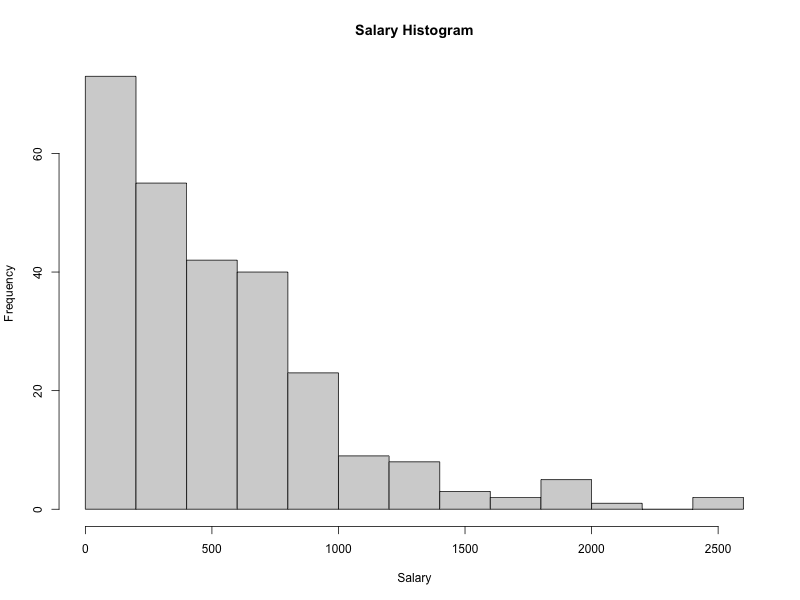
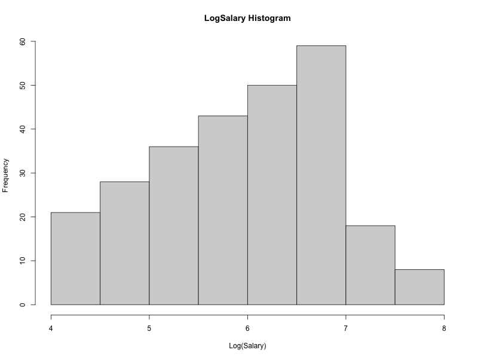
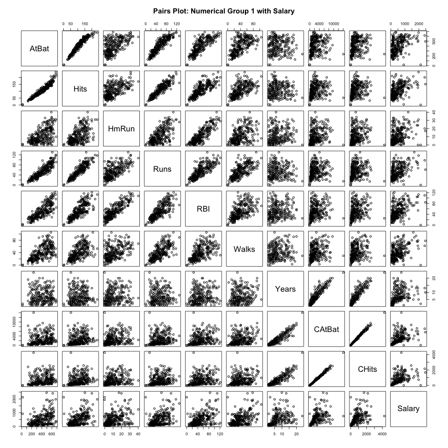
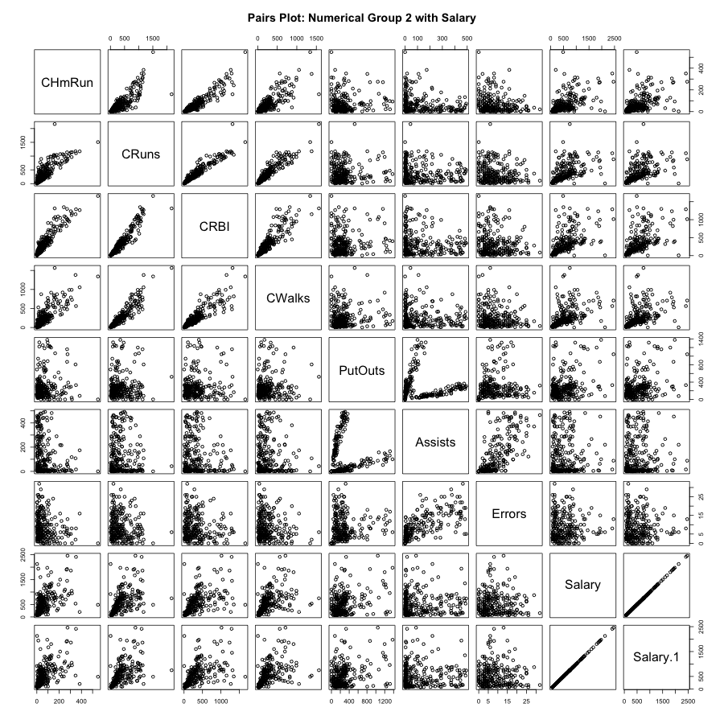
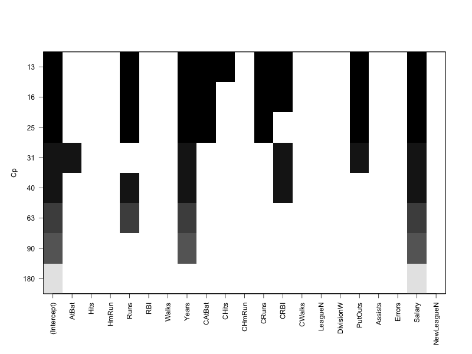
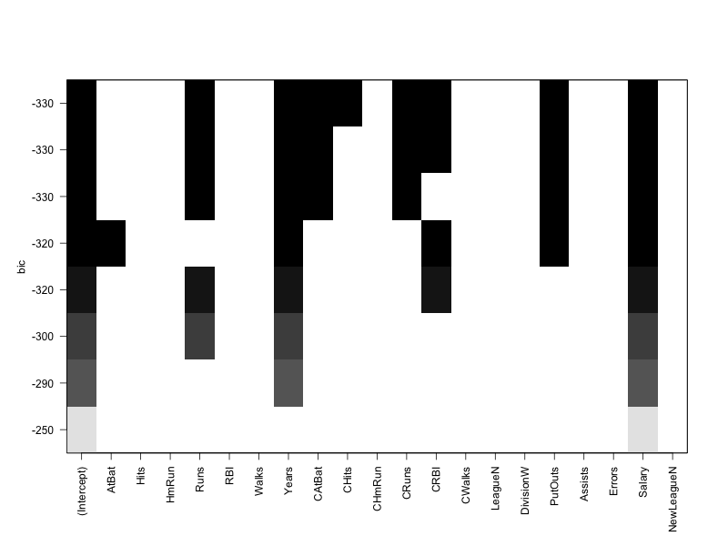
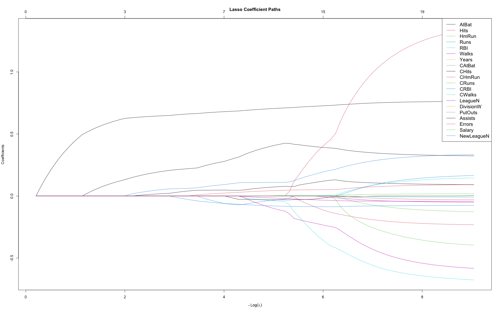

# Machine Learning Tutorial 01: Feature Selection in R
In this tutorial, we explore various linear modeling and feature selection techniques using a baseball dataset. The goal is to identify the most important predictors of player salaries and understand how different methods approach feature selection and regularization.

We will cover:  

1. **Data Preparation** – Clean, Transform, Split 
2. **Exploratory Data Analysis** - Visualizing the Target Variable and Pairwise Relationships
3. **Linear Regression** – 
4. **Best Subsets**
5. **Stepwise Selection** – Forward & Backward  
10. **Regularization Methods** – Lasso and Elastic Net

Additionally, we will **visualize regularization paths** to see how coefficients change with tuning parameters, and evaluate model performance on training, validation, and test sets.  

This tutorial combines **theory, coding, and interpretation** so you can both implement these methods in R and understand their practical implications for prediction and feature selection.

## Setup Instructions

### 1. Install R (if not installed)
- Download from [CRAN](https://cran.r-project.org/)  

### 2. Install Required Packages

```r 
install.packages(c(
  "ISLR2",
  "glmnet",
  "leaps",
  "MASS",
  "stats",
  "tidyverse",
  "caret",
  "dplyr",
  "purrr",
  "naniar"
))

````

### 3. Load the Libraries and Hitters dataset

- Option 1: Load data from ISLR2 package
  
- Option 2: Load data from local data file 

```r
library(ISLR2)
library(glmnet)
library(leaps)
library(MASS)
library(stats)
library(tidyverse)
library(caret)
library(dplyr)
library(purrr)
library(naniar)

data("Hitters")  #option 1

Hitters <- read.csv("Data/hitters_data.csv") #option 2

str(Hitters)       # structure
summary(Hitters)   # summary stats
head(Hitters)      # first rows
dim(Hitters)       # dimensions
```

### 4.Data Preparation: Handling Numeric and Categorical Variables

We clean, transform, and split the data into training, validation, and test sets. Categorical variables are converted to numeric dummies, and all features are standardized (mean = 0, SD = 1) so they contribute equally to Lasso, Elastic Net, and Ridge models. The target is centered to improve numerical stability for regression and regularization.

### 5.Exploratory Data Analysis: Pairwise Relationships

Here, we visualize the salary distribution after cleaning and log transformation to understand the target variable and the effect of log scaling.
We also explore relationships among numerical features and the response (Salary) using scatterplot matrices, helping to identify correlations and potential patterns in the data.

### Salary Distributions



### Pairwise Relationships




### 6.Least Squares for Feature Selection

We fit a standard linear regression (Least Squares) model to predict log-transformed Salary using all features. We use the training set to fit the model and can later evaluate on validation or test sets.

### 7.Best Subsets for Feature Selection

Identify the best combination of predictors to explain log-salary using criteria like **Adjusted R², Cp, and BIC**.

- **Adjusted R²:** Higher is better; balances variance explained and model complexity.  
- **Cp:** Lower is better; balances bias and variance.  
- **BIC:** Lower is better; favors simpler, interpretable models.

Focus on predictors consistently chosen across criteria — these are likely the most important features.

### Best Subsets Feature Selection

#### Plots
  
  


### 8.Stepwise Feature Selection

Stepwise regression automatically selects a subset of features using a greedy approach:  

- **Forward selection:** Start with no predictors, add one at a time based on a criterion (e.g., AIC, BIC).  
- **Backward elimination:** Start with all predictors, remove one at a time.  
- **Both directions:** Combines forward and backward steps.  

The goal is to find a model that balances goodness-of-fit and simplicity. AIC or BIC is commonly used as the selection criterion.

### 9.Lasso Regression

Lasso (Least Absolute Shrinkage and Selection Operator) is a linear regression technique with regularization.  

- It penalizes large coefficients to prevent overfitting.  
- Some coefficients can shrink exactly to zero, effectively performing **feature selection**.  
- The penalty is controlled by λ (lambda): larger λ → more shrinkage.  
- λ is usually chosen via **cross-validation**.  

Lasso works well when you have many predictors and want both regularization and automatic variable selection.

  

### 10.Elastic Net Regression

Elastic Net combines **Lasso** (L1) and **Ridge** (L2) penalties.  

- Performs variable selection like Lasso while handling correlated predictors like Ridge.  
- Optimal regularization strength (λ) is chosen via cross-validation.  
- Some coefficients shrink toward zero, while others are retained, producing a stable and predictive model.
